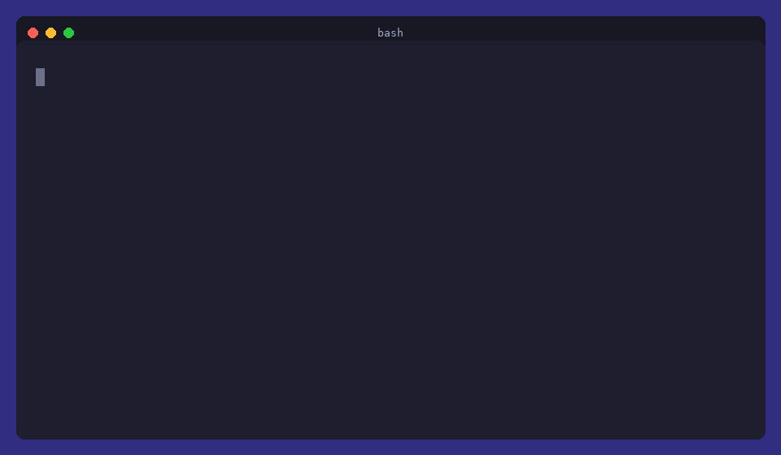

<div align="center">

# ccmorph

**Every Claude Code account, API key and gateway behind one command.**

[Install](#install) · [Quick start](#quick-start) · [Usage](#usage) · [Docs](docs/guide.md)



</div>

## Highlights

- **One profile per backend.** Each subscription, API key or gateway gets its own
  login and settings. Skills, plugins, hooks, `CLAUDE.md` and session history
  stay shared.
- **Hop mid-session.** `ccmorph hop <profile>` moves a running conversation to
  another profile, keeping its model and effort.
- **Any endpoint.** Gateways that do not speak Anthropic's API are translated
  automatically through a per-launch adapter.
- **Cost per profile.** Every gateway turn leaves a receipt with the billed cost;
  [ccusage](https://github.com/ccusage/ccusage) turns them into daily reports.
- **Leaves `claude` alone.** No wrapper, no patch: native arguments pass through.
  See [Scope and ownership](docs/ARCHITECTURE.md#scope-and-ownership).

```
                   +--> work       subscription login  -->  Anthropic
ccmorph run  ------+--> personal   API key             -->  Anthropic API
                   +--> gateway    API key             -->  any other model API
                                                            (translated for you)
```

## Requirements

- `zsh` and the `claude` CLI. The installer names the command to install a missing
  one for your package manager, and stops. `python3` 3.8 or newer is needed only
  for the optional Remote Control add-on.
- A release ships `ccmorph-core` prebuilt for macOS and Linux (arm64, amd64).
  Installing from a clone needs Go to build it (`make shim`).
- Optional: `cliproxyapi` for non-Anthropic endpoints, `fzf` for searchable
  pickers. The installer offers fzf through your package manager and
  cliproxyapi through Homebrew, and installs only on confirm.
- macOS or Linux. On Windows, use WSL.

## Install

With Homebrew:

```sh
brew install akleizor/tap/ccmorph
ccmorph doctor
```

Type the full `akleizor/tap/ccmorph` name: Homebrew trusts a third-party tap's
formula only when it is named that way. Prebuilt bottles cover Apple silicon on
the newest macOS and Linux x86_64; anywhere else Homebrew builds from source and
installs Go for the build. Update with `brew upgrade ccmorph` and remove with
`brew uninstall ccmorph`: `ccmorph update` and `ccmorph uninstall` refuse a
Homebrew install and print those commands.

From a clone:

```sh
git clone https://github.com/akleizor/ccmorph && cd ccmorph && make shim && ./install.sh
```

Or the one-liner:

```sh
sh -c "$(curl -fsSL https://github.com/akleizor/ccmorph/releases/latest/download/install.sh)"
ccmorph doctor
```

The one-liner installs the latest release: it downloads that release's
`ccmorph.tar.gz` and runs its installer. `CCMORPH_REF` (a branch or tag)
installs unreleased code from the GitHub archive of that ref — `CCMORPH_REF=main`
for the bleeding edge — and `CCMORPH_INSTALL_URL` replaces the whole tarball URL.
`curl -fsSL ... | sh` also works, but it has no terminal to ask on, so it declines
the optional installs and prints the commands instead.

The installer (clone or one-liner) copies the runtime (`lib/`, `libexec/`, `share/`) into `~/.config/ccmorph` and the `ccmorph`
command into `~/.local/bin`. It never edits shell startup files; if
`~/.local/bin` is not on your `PATH`, it prints the line to add, for your shell.

For a clone or one-liner install, update with `ccmorph update` (the latest release; `ccmorph update <branch-or-tag>`
for another), or run the same install again; profiles, credentials, and `local.sh`
are preserved. A git clone is updated with git instead. `ccmorph uninstall` removes the command and
leaves your profiles alone; it lists what it left and the commands that remove it.

## Quick start

A fresh install has no profiles.

```sh
ccmorph doctor           # check zsh, claude and PATH
ccmorph add work         # create a profile: login or credential paste
ccmorph run              # launch Claude Code on it
```

The first profile you add becomes the default. `ccmorph list` shows the
profiles with the default marked, and `ccmorph use <profile>` changes it.

## Usage

```sh
ccmorph run <profile>              # launch on a profile for this session
ccmorph use <profile>              # make a profile the default for `ccmorph run`
ccmorph run -i                     # choose the profile, then the model
ccmorph run <profile> --model <id> # profile plus explicit model
ccmorph run work mcp list          # native Claude Code arguments pass through
ccmorph config <profile>           # change model, reasoning, or connection
ccmorph set <profile> model -i     # save a default model, chosen from the endpoint
ccmorph inspect [<profile>]        # effective settings and where each came from
ccmorph doctor [<profile>]         # check why a profile is not working
ccmorph quota [<profile>] [--json] # every profile's plan usage, spend and API balance
```

To switch a running session, type in the Claude Code prompt:

```
/ccmorph:hop personal
```

`! ccmorph hop personal` does the same.

`ccmorph --help` shows everyday commands, `ccmorph help all` the full list, and
`ccmorph help <command>` the details of one.

## Usage and cost

Each turn a profile serves writes one receipt under
`~/.local/state/ccmorph/usage/<YYYY-MM-DD>/` — the day folder of the
receipt's UTC stamp: tokens, the model that answered, and the
cost the gateway billed when it reports one — otherwise an estimated cost at
the provider's models.dev list price, marked as an estimate in the receipt and
the export. The day folders are an index, so a reader with a time window opens
only the folders its window touches rather than every receipt ever written;
the report also moves any rows a pre-shard store still holds flat into their
day folders, once. No prompt, header or credential is stored. Export the
receipts and read them with ccusage:

```sh
scripts/usage-export --output ~/.cache/ccmorph-usage
CLAUDE_CONFIG_DIR=~/.cache/ccmorph-usage ccusage claude daily --instances \
  --config ~/.cache/ccmorph-usage/ccusage.json
```

Each profile is one ccusage project. A billed cost is used as is and a
shim-computed one is marked `costSource: estimate`; a turn with neither is
priced by ccusage at the provider's list price.

Every profile writes these receipts: `apikey`, `provider`, and also `sub` and
`token`. No launch changes how a session reaches its backend: a `sub` or `token`
session keeps talking to api.anthropic.com with its own credential, and the
launch installs a `SessionStart`, `Stop` and `SessionEnd` hook that reads the
usage Claude Code itself records in the session's transcript, one row per API
response, however many transcript lines it spans. `SessionStart` writes no row:
it marks where this launch begins reading, so a resumed transcript's earlier
turns are not charged to this profile. A gateway's billed
`cost` is only ever what it charged. A subscription or long-lived token is not
billed per token, so its row carries `estimated_cost` instead — the same
models.dev list price, marked `costSource: estimate` in the export, and never
added to a billed total. A row's estimate uses the price snapshot cached at
launch; a model with no cached price keeps its tokens and carries no estimate.
`usage_route=direct` in a profile's conf installs no hook and writes no
receipts.

## Configuration

A profile is one file, `~/.config/ccmorph/<name>.conf`, of `key=value` lines;
`profile.conf.example` is the template and lists every allowed key. Runtime state
lives under `~/.config/ccmorph/profiles/<name>`. The state root is
`$CCMORPH_STATE_DIR`, else `$XDG_CONFIG_HOME/ccmorph`, else `~/.config/ccmorph`.
Use `ccmorph rm` and `ccmorph mv` rather than editing files by hand.

Common keys: `type`, `base_url`, `api_key`, `model`, `effort`,
`excluded_models`, and `context_window.<model>`. To reach a private endpoint,
export `HTTPS_PROXY` for the command; ccmorph passes it through unchanged.

The [user guide](docs/guide.md) covers every setting, gateway behavior, context
windows and probing, switching, and state migration.

## Documentation

| Doc | Covers |
|---|---|
| [docs/guide.md](docs/guide.md) | Full usage and configuration reference |
| [docs/ARCHITECTURE.md](docs/ARCHITECTURE.md) | How sessions reach a backend, and why |
| [.github/SECURITY.md](.github/SECURITY.md) | Where credentials live and what protects them |
| [CHANGELOG.md](CHANGELOG.md) | What changed in each version |
| [addons/remote-control/README.md](addons/remote-control/README.md) | Remote Control bridge add-on |

## Tests

```sh
make test
```

CI runs the same suites on Linux and macOS (`.github/workflows/ci.yml`).

## License

MIT — see [LICENSE](LICENSE).
